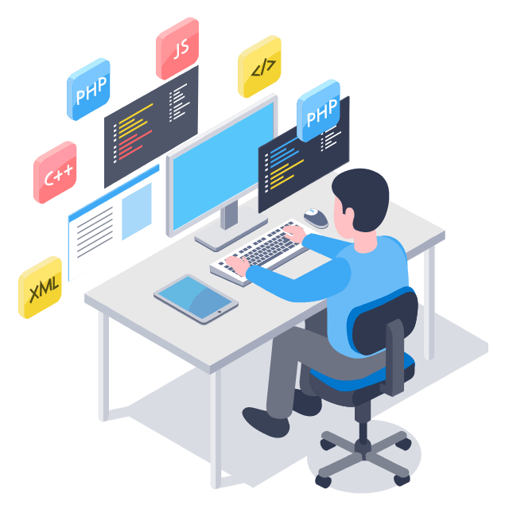

<!-- Profile Views -->

  

 

<!-- GIF -->

  

 

<!-- Introduction -->
<h1 align="center">
  Hey 👋, I'm Naimul Huda Jihan
</h1>

  

 

<!-- About Me -->
<h2>🤵 About Me</h2>

  I'm a Full-Stack Web Developer in progress who enjoys building modern,
  responsive, and user-friendly web applications. I love turning ideas into
  functional digital experiences and continuously improving my development
  skills through real-world projects and consistent learning.

  I'm currently focused on strengthening my skills in React, Next.js,
  TypeScript, Tailwind CSS, and modern web development practices.

---

<!-- What I Do -->
<h2>🚀 What I Do</h2>

<table align="center" border="0">
  <tr>
    <td width="60%" valign="top">
      <ul>
        <li>💻 Build modern and responsive web applications</li>
        <li>⚛️ Develop interactive user interfaces with React</li>
        <li>▲ Build scalable applications with Next.js</li>
        <li>🎨 Create clean and responsive designs with Tailwind CSS</li>
        <li>🔷 Write maintainable and type-safe code with TypeScript</li>
        <li>🔐 Work with authentication and modern web application features</li>
        <li>📚 Continuously learn and explore new technologies</li>
      </ul>
    </td>

   <td width="40%" align="center" valign="middle">
      
    </td>
  </tr>
</table>

<!-- Currently Exploring -->
<h2>📚 Currently Exploring</h2>

<ul>
  <li>Advanced Next.js concepts</li>
  <li>Full-Stack application development</li>
  <li>TypeScript best practices</li>
  <li>Modern authentication systems</li>
  <li>Performance and scalable web applications</li>
  <li>Real-world project development</li>
</ul>

<!-- Tech Stack -->

<h2>🛠️ Tech Stack</h2>

<h3 data-importer="text" align="center">Frontend:</h3>

###

  
  
  
  
  
  
  
  
  
  
  

###

<h3 data-importer="text" align="center">Frameworks:</h3>

###

  

###

<h3 data-importer="text" align="center">Tools:</h3>

###

  
  
  
  
  

---

<!-- Development Philosophy -->
<h2>💡 Development Philosophy</h2>

  

    <b>Learn → Build → Improve → Repeat</b>
  

  

    I believe consistent learning and real-world practice are the keys
    to becoming a better developer.
  

---

<!-- GitHub Stats -->
<h2>📊 GitHub Stats</h2>

<table align="center" border="0">
  <tr>
    
<!-- GitHub Stats -->
<td width="50%" align="center" valign="top">

  

    

  

   </td>

<!-- Top Languages -->
 <td width="50%" align="center" valign="top">

  

    

  

  </td>

  </tr>
</table>
<!-- Pacman -->

  

---

<!-- Connect -->
<h2>🔗 Connect With Me</h2>

  

  

  

  

  

  

---

<!-- Footer -->

  

    <b>Thanks for visiting my profile! 🚀</b>
  

  

    Let's learn, build and grow together.
  

